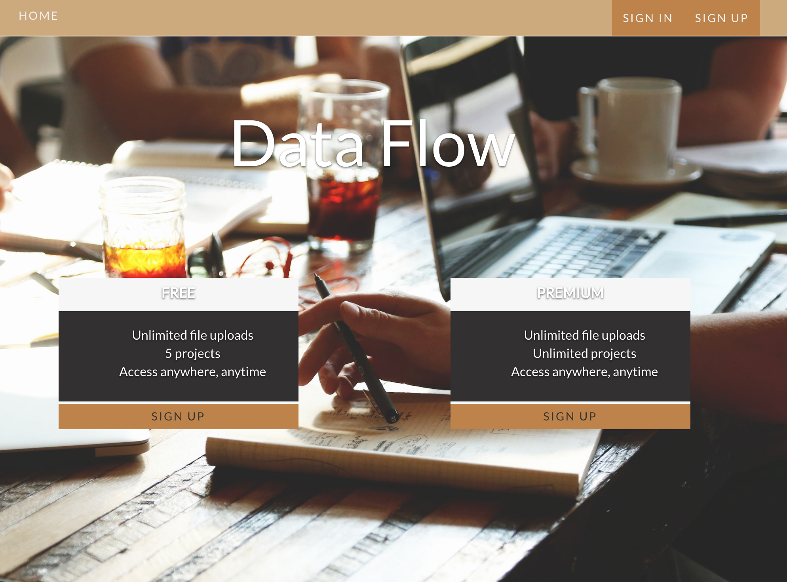

# Data Storage App

<div style="box-shadow: 0 12px 15px 0 rgba(0,0,0,0.24),0 17px 50px 0 rgba(0,0,0,0.19);"><a href="https://sanlouise-dataflow.herokuapp.com/" alt="Data Flow"><center></center></a></div>

Welcome to Data Flow. Teams can sign up for a free or paid (in TEST) account to manage their data and deadlines for ongoing projects.

## Getting Started Locally

```
git clone git@github.com:sanlouise/saas-data-storage.git

cd project-mgt

bundle

bundle exec rake db:create
bundle exec rake db:migrate

bundle exec rails server
```

Your app will now be running on [localhost:3000](http://localhost:3000).

## Contributing

1. Fork the repo
2. Create your feature branch: 

`git checkout -b my-new-feature`

3. Commit your changes: 

`git commit -am 'Add some feature'`

4. Push to the branch: 

`git push origin my-new-feature`

5. Submit a pull request and get listed as a contributor!

## Credits

* [sanlouise](https://github.com/sanlouise)

## License

[MIT License](LICENSE).